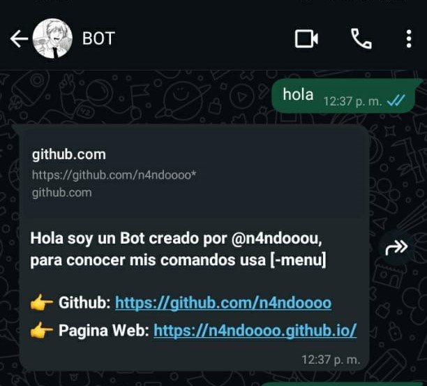
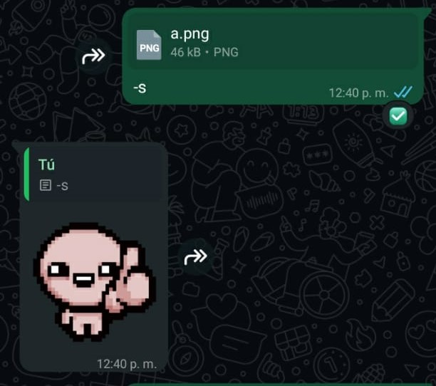

## Este es un ChatBot de whatsapp usando la libreria [whatsapp-web.js](https://wwebjs.dev/)
*Este es uno de mis primeros proyectos que subo a github, Este podria contener bugs o errores asi que agradeceria mucho el feedback!*

### Instalacion:
> Es necesario tener instalada la ultima version de NodeJS para instalar estas librerias:
> `npm i libreria`
- @ffmpeg-installer/ffmpeg
- qrcode-terminal
- whatsapp-web.js

### Uso:
> Ahora para prender el bot, solo hace falta escribir el comando: `node app.js`
> el cual va a generar un codigo QR el cual debes de escanear para darle acceso al bot.

### Comandos:
- Por ahora es un simple bot de Stickers, al mandarle un documento, video e imagen con el comando [-s] este te enviara un sticker

### Imagenes:

